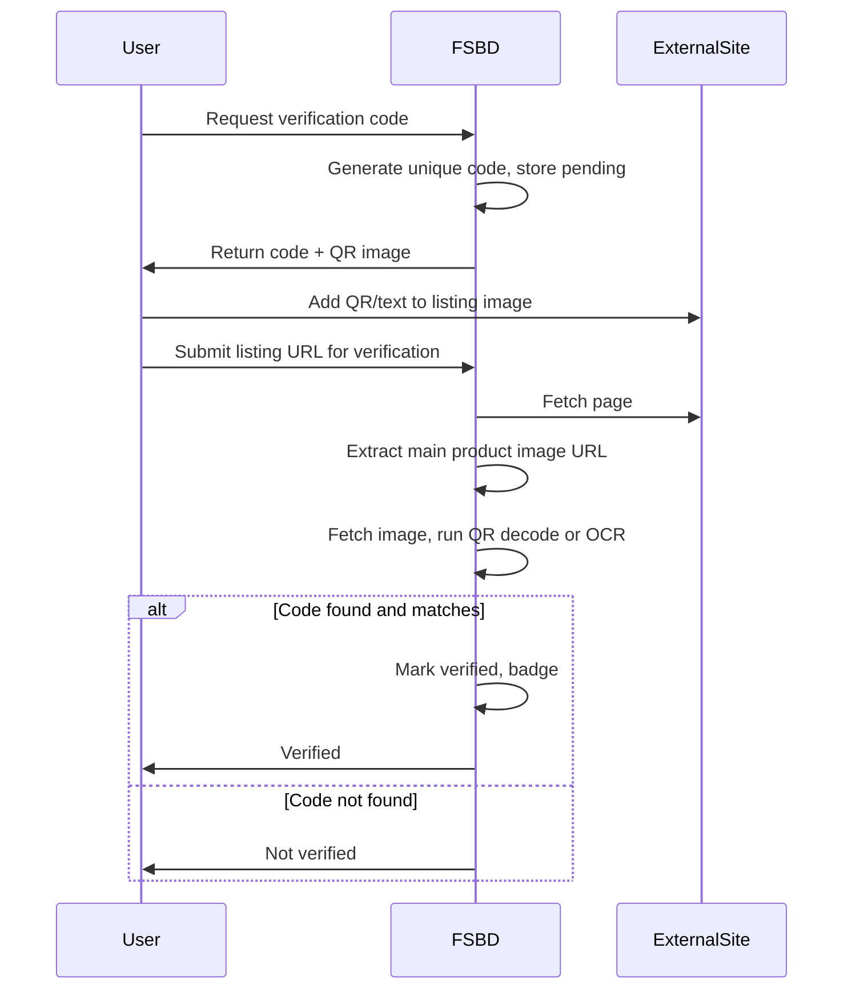

# Seller Verification Plan

This document outlines the plan for verifying that sellers own or control the external listings they claim (Amazon, eBay, Etsy, etc.), via OAuth and manual image-based verification.

---

## Part 1: OAuth Verification (Platform Integration)

### Platform Support Matrix

| Platform | OAuth 2.0 | Seller Verification | Developer Barrier | Recommendation |
|----------|-----------|---------------------|-------------------|----------------|
| **eBay** | Yes (authorization code grant) | Yes – `sell.account` scope | Low – register at developer.ebay.com | **Implement first** |
| **Etsy** | Yes (Open API v3, PKCE) | Yes – shop info via OAuth | Low for personal access; commercial needs approval | **Implement second** |
| **Amazon** | Yes (SP-API / LWA) | Yes – seller central access | High – business verification, security review | **Phase 2 / optional** |
| **Mercari** | No standard OAuth | Personal API tokens only | Sellers self-generate | Skip for now |
| **Poshmark / Depop** | Limited / undocumented | Unknown | N/A | Skip for now |

---

### eBay OAuth (Recommended First)

**Docs**: https://developer.ebay.com/api-docs/static/oauth-tokens.html

- **Flow**: Authorization code grant (redirect to eBay, user approves, callback with code, exchange for access + refresh tokens)
- **Scopes**: `https://api.ebay.com/oauth/api_scope/sell.account` (seller account info)
- **What we get**: User token proves they own an eBay seller account; we can fetch seller/store info
- **Setup**: Create app at developer.ebay.com → Application Keys (Sandbox + Production)
- **Environment vars**: `EBAY_APP_ID`, `EBAY_CERT_ID`, `EBAY_RU_NAME` (RuName = redirect URL name)

**Implementation outline**:

1. `/api/verify/ebay/connect` – generate auth URL, store `state` in session/DB
2. `/api/verify/ebay/callback` – exchange code for tokens, fetch seller info, store in `seller_verifications`
3. Profile page: “Connect eBay” button → OAuth flow → verified badge + linked store URL

---

### Etsy OAuth (Second Priority)

**Docs**: https://developer.etsy.com/documentation/essentials/authentication/

- **Flow**: OAuth 2.0 with PKCE
- **Endpoint**: `https://www.etsy.com/oauth/connect` (authorize) → `https://api.etsy.com/v3/public/oauth/token` (exchange)
- **What we get**: Shop info (name, URL) – proves they control an Etsy shop
- **Setup**: Register at https://www.etsy.com/developers/register → API key + shared secret
- **Access**: Personal (own shop) – easy; Commercial (any seller) – requires approval
- **Environment vars**: `ETSY_CLIENT_ID`, `ETSY_CLIENT_SECRET`, `ETSY_REDIRECT_URI`

---

### Amazon SP-API (Phase 2 / Optional)

**Docs**: https://developer-docs.amazon.com/sp-api/docs/authorize-public-applications

- **Flow**: OAuth via Login with Amazon (LWA)
- **Requirements**: Developer registration, business verification, security review; Professional Seller Central (individual accounts not eligible)
- **Use case**: Only pursue if FSBD gains significant traction and Amazon verification becomes a key ask

---

### Database Schema for OAuth Verifications

New table: `seller_verifications`

```sql
CREATE TABLE seller_verifications (
  id UUID DEFAULT gen_random_uuid() PRIMARY KEY,
  wallet_address_hash TEXT NOT NULL,
  platform TEXT NOT NULL CHECK (platform IN ('ebay','etsy','amazon','manual')),
  platform_user_id TEXT,
  platform_username TEXT,
  store_url TEXT,
  access_token_encrypted TEXT,
  refresh_token_encrypted TEXT,
  token_expires_at TIMESTAMPTZ,
  verified_at TIMESTAMPTZ DEFAULT now(),
  created_at TIMESTAMPTZ DEFAULT now(),
  updated_at TIMESTAMPTZ DEFAULT now(),
  UNIQUE(wallet_address_hash, platform)
);
```

- Store tokens encrypted (use existing pattern like `VANITY_POOL_ENCRYPTION_KEY` or a dedicated `SELLER_VERIFICATION_ENCRYPTION_KEY`)
- `platform_user_id` / `platform_username` / `store_url` for display and linking

---

### Profile / Badge Display

- Add `verified_seller_badges` (or derive from `seller_verifications`) for profile and listing cards
- Example: “Verified eBay Seller” badge with link to their eBay store
- Optionally: `profiles.verified_external_store_url` for a primary linked store (e.g. first verified platform)

---

## Part 2: Manual Verification via Code in Listing Image

For platforms without OAuth (or while OAuth is in progress), users verify by placing a unique code in their listing image.

### Flow Overview



### Code Format Options

| Method | Pros | Cons |
|--------|------|------|
| **QR code** | Robust, easy to decode (jsQR), works at small size | User must overlay QR on image |
| **Text overlay** | Simple for user | OCR (Tesseract) can fail on angles/fonts |
| **Branded watermark PNG** | Professional look | Harder to auto-detect; better for manual review |

**Recommended**: QR code containing `FSBD-{shortId}` (e.g. `FSBD-A1B2C3`). User downloads QR, adds to corner of product image, saves, and re-uploads to their listing.

### Technical Implementation

1. **Code generation**
   - Endpoint: `POST /api/verify/code/request` (body: `{ wallet }`)
   - Generate 6–8 char alphanumeric code, store in `pending_verifications` with `wallet_address_hash`, `code`, `expires_at` (e.g. 7 days)
   - Return: `{ code: "FSBD-A1B2C3", qrDataUrl: "data:image/png;base64,..." }`

2. **QR generation**
   - Use `qrcode` (npm) to create PNG data URL from `code`
   - Optional: branded frame (FSBD logo + code)

3. **Verification**
   - Endpoint: `POST /api/verify/code/verify` (body: `{ wallet, listingUrl }`)
   - Reuse `/api/fetch-product-info` logic: fetch HTML, extract main product image URL (`og:image` or first large image)
   - Fetch image as `ArrayBuffer` → decode with `jsQR` (works in Node with `jimp` or `sharp` for bitmap)
   - Search image for QR; if found, decode payload and compare to stored code
   - If match: insert into `seller_verifications` with `platform: 'manual'` and `store_url: listingUrl` (or similar)

4. **Fallback for text-only**
   - If QR not found, optionally run Tesseract.js OCR on image
   - Look for pattern `FSBD-[A-Z0-9]{6,8}` in OCR text
   - Less reliable; can be Phase 2

### Database for Pending Codes

```sql
CREATE TABLE pending_verifications (
  id UUID DEFAULT gen_random_uuid() PRIMARY KEY,
  wallet_address_hash TEXT NOT NULL,
  code TEXT NOT NULL,
  platform TEXT DEFAULT 'manual',
  expires_at TIMESTAMPTZ NOT NULL,
  created_at TIMESTAMPTZ DEFAULT now()
);
```

For successful manual verifications, reuse `seller_verifications` with `platform = 'manual'` and `store_url` = the verified listing URL.

### Edge Cases

- **Multiple images**: Use `og:image` first; if multiple product images, prefer largest or first
- **Image format**: Support JPEG, PNG, WebP (sharp/jimp handle these)
- **CORS / hotlinking**: Fetch server-side; no CORS issues
- **Expired codes**: Reject verification if `expires_at` passed
- **One-time use**: Delete or mark `pending_verifications` row as used after success

---

## Part 3: Implementation Order

### Phase 1 – OAuth (eBay + Etsy)

1. Create `seller_verifications` and `pending_verifications` migrations
2. Implement eBay OAuth: connect + callback + token refresh
3. Implement Etsy OAuth (PKCE): connect + callback
4. Profile UI: “Verify seller account” section with platform buttons
5. Display verified badges on profile and seller page

### Phase 2 – Manual Image Verification

1. `POST /api/verify/code/request` – generate code + QR
2. `POST /api/verify/code/verify` – fetch image from URL, decode QR, validate
3. Profile UI: “Verify with listing image” – request code → download QR → submit URL
4. Reuse `seller_verifications` with `platform = 'manual'`

### Phase 3 (Optional)

- Amazon SP-API if demand justifies the approval process
- Tesseract fallback for text-based code in images
- Periodic re-verification for OAuth (token refresh; revoke if refresh fails)

---

## Security Notes

- Encrypt OAuth tokens at rest
- Use `state` (and PKCE for Etsy) to prevent CSRF
- Rate limit verification attempts (code request, code verify)
- Do not expose raw codes in logs

---

## Files to Create / Modify

| File | Purpose |
|------|---------|
| `supabase/migration_seller_verifications.sql` | New tables |
| `app/api/verify/ebay/connect/route.ts` | Start eBay OAuth |
| `app/api/verify/ebay/callback/route.ts` | eBay callback |
| `app/api/verify/etsy/connect/route.ts` | Start Etsy OAuth |
| `app/api/verify/etsy/callback/route.ts` | Etsy callback |
| `app/api/verify/code/request/route.ts` | Generate code + QR |
| `app/api/verify/code/verify/route.ts` | Verify image |
| `app/components/SellerVerificationSection.tsx` | Profile UI |
| `app/lib/verify-encryption.ts` | Token encryption helpers |
